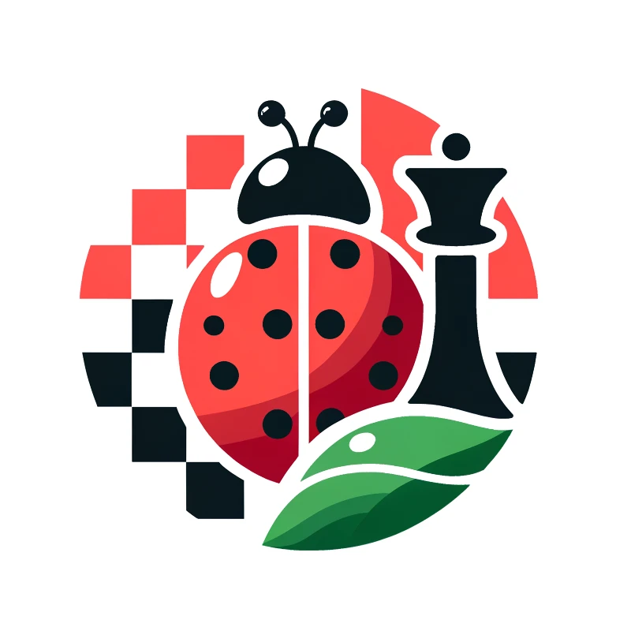

<h3>Ladybug</h3>

A free and <s>strong</s> weak UCI chess engine.

## Overview

This is my attempt at writing a chess engine in Rust. 
Before starting this project, I knew next to nothing about neither chess engines nor Rust.

The original goal was to write a chess engine that could beat me  (~1500 Blitz on Chess.com).
That goal has now been reached. I do however not think Ladybug is finished at all. It feels like I just started. I see so many avenues of improvement. There are so many features I want to implement. So Ladybug is still very much "work in progress".

## License

MIT License. You can do with the code what you want. This is a hobby project I'm doing for fun, so I'd be glad if others find the code useful.